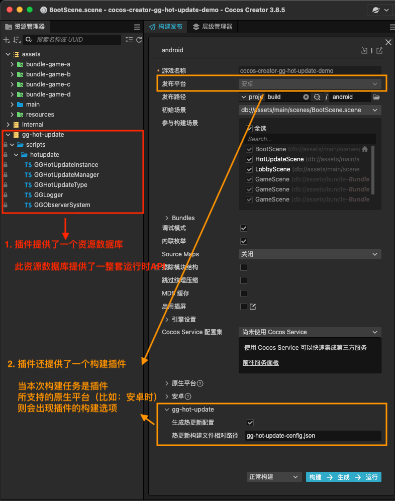
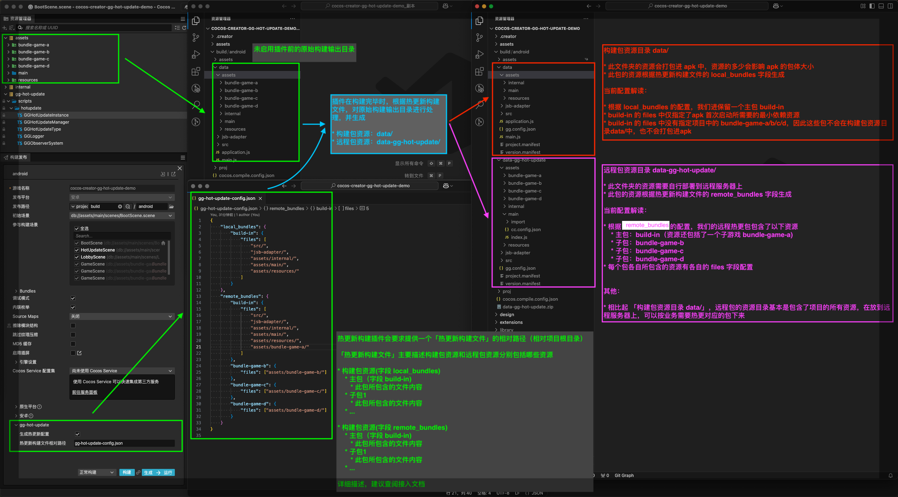

# 【GG插件】热更新

## 开发者的话

* 加QQ: **`554939014`** ，提前咨询，购买后提供 **1v1** 接入支持
* 插件 **基本全源码**，可随时根据自己需求二改
* 插件 **已稳定更新一年**，质量有保证

## 插件相关资源

> -   查阅 [插件官方文档](https://www.yuque.com/dhunterstudio/gg/hot-update)
> -   查阅 [插件官方 Demo](https://github.com/zhitaocai/cocos-creator-gg-hot-update-demo)
> -   查阅 [插件官方 Demo 演示视频](https://github.com/user-attachments/assets/e8038e3d-0e56-4c98-bd1e-79329653e7d2)
> -   查阅 [插件论坛地址](https://forum.cocos.org/t/topic/161655)
> -   查阅 [插件更新日志](https://www.yuque.com/dhunterstudio/gg/hot-update-changelog)
> -   查阅 [插件升级指南](https://www.yuque.com/dhunterstudio/gg/hot-update-migration-guide)

## 一、介绍

**gg-hot-update/热更新插件是一款基于 Cocos Creator 官方的热更新原理，重新采用 DownloadTask 进行编写的热更新插件。** 相比起原来的 Cocos Creator 官方的热更新方案，我们的热更新方案具有以下优势：

1. **支持整包热更新**
2. **👍 支持主包+多个子包热更新**
3. **👍 无需在构建热更包时指定部署地址。** 支持运行时动态传入不同的热更新地址([了解更多](https://www.yuque.com/dhunterstudio/gg/hot-update#n3B3N))
4. **👍 无需指定主包/子包的版本号。** 只要构建后有差异，插件将自动赋值新版本([了解更多](https://www.yuque.com/dhunterstudio/gg/hot-update#b5TG6))
5. **👍 支持跨版本热更新**（假设存在版本 1.0.0、1.1.0、1.2.0，我们可以从 1.0.0 版本升级到 1.2.0）
6. **👍 支持跨版本回滚**（假设存在版本 1.0.0、1.1.0、1.2.0，我们可以从 1.2.0 版本回滚到 1.0.0）
7. **支持断线重连**
8. **支持检查更新时返回新版本的详细信息，以方便开发 UI 界面**
    - 总下载字节数
    - 累计下载的字节数
    - 总下载文件数
    - 累计下载成功文件数
9. **👍 提供一整套 API，实现上述所有功能**
10. **👍 提供一整套文档，描述上述所有功能**
11. **👍 提供一整套编辑器的「构建插件」，方便生成构建包资源和远程包资源**：
    1. 构建插件 **支持 Cocos Creator 3.6+** 的编辑器版本
    2. 构建插件 **支持对原生平台生成** 构建包资源和远程包资源。目前支持的原生平台如下：
        - Android
        - GooglePlay
        - iOS
        - Windows
        - Mac
    3. 👍 构建插件 **支持构建后自动生成** 构建包资源和远程包资源
    4. 构建插件 **支持通过命令行/CLI** 构建包资源和远程包资源

## 二、插件安装预览

插件安装后，将会提供两个部分：

-   插件资产库：提供一整套运行时 API
-   插件构建插件：提供构建后自动生成热更包配置的能力

## 三、插件构建预览

以 Android 平台为例，构建任务时，插件会在构建完毕时，根据「热更新构建配置文件」，对原始输出目录进行处理，最终生成两份资源

-   构建包资源目录：构建 apk 时会打包进 apk 的资源
-   远程包资源目录：远程热更新包的资源，需要将此目录资源部署到你的服务器上

以下图为例：

-   构建包资源目录路径为: `build/android/data`
-   构建包资源目录路径为: `build/android/data-gg-hot-update`

## 四、Demo 演示视频

https://github.com/user-attachments/assets/e8038e3d-0e56-4c98-bd1e-79329653e7d2

## 五、接入插件

-   查阅 [插件官方文档](https://www.yuque.com/dhunterstudio/mydoid/qshphh)
-   查阅 [插件官方 Demo](https://github.com/zhitaocai/cocos-creator-gg-hot-update-demo)

## 六、联系作者

-   QQ: 554939014
-   邮箱: 554939014@qq.com
-   更多关于我的其他作品，可以[点击这里查看](https://store.cocos.com/app/search?name=saisam)

## 七、版权声明

-   此插件源代码可商业使用
-   商业授权范围仅限于在您自行开发的游戏作品中使用
-   不得进行任何形式的转售、租赁、传播等

## 八、购买须知

-   本产品为付费虚拟商品，一经购买成功概不退款，请在购买谨慎确认购买内容。
